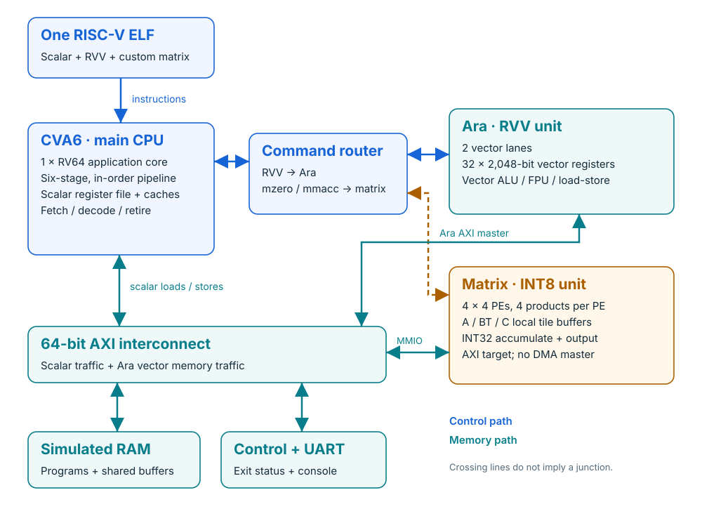

# Proton NPU

**Cerebral Chips' open hardware platform for scalar, vector and matrix computing.**
One CVA6 RISC-V CPU runs a single bare-metal ELF containing scalar instructions,
RVV instructions executed by Ara, and custom instructions for a 4×4 integer PE mesh.
The current milestone is verified in RTL simulation on Apple Silicon through an
ARM64 Linux VM.



[Architecture website](https://cerebralchips.github.io/proton-npu/) ·
[Documentation index](docs/README.md) · [Run guide](docs/matrix-running.md) ·
[Verification records](verification/README.md) · [Contributing](CONTRIBUTING.md)

## Current hardware

| Block | Configuration |
| --- | --- |
| CVA6 | One RV64 application core; actual CPU pipeline enabled |
| Ara | RVV 1.0, two lanes, VLEN 2048 bits, ELEN 64 bits |
| Matrix | 4×4 PEs, four signed INT8 products per PE, INT32 accumulation |
| Matrix operation | `C[4][4] += A[4][16] × transpose(BT[4][16])`, modulo 2³² |
| Integration | Custom-1 `mzero` / `mmacc`; AXI-Lite mapped buffers at `0xe0000000` |
| Software | LLVM 20.1.0, RVV intrinsics and inline `.insn`; Newlib bare-metal runtime |

The matrix buffers are filled and read by CPU loads/stores. This version has no
matrix DMA or direct vector-register connection. There is no measured silicon
frequency or TOPS result. Linux, IREE, synthesis and full ISA compliance are future
milestones; see [scope and evidence](docs/status.md).

## Build and run

Supported provisioning profile: **Ubuntu 24.04 ARM64**. Apple Silicon uses Lima
with 6 virtual CPUs, 8 GiB RAM and 4 GiB swap; allow substantial disk space for
LLVM, toolchains and simulator builds. The Linux guest builds the simulator;
the RISC-V program executes on simulated RTL, not on the Mac's CPU ISA.

```bash
git clone --branch hardware https://github.com/cerebralchips/proton-npu.git
cd proton-npu
./scripts/ara vm-start       # Mac: download/check Lima and create/start the VM
./scripts/ara provision      # Install pinned tools, dependencies and patches
./scripts/ara doctor         # Inspect source pins, tools and configuration
./scripts/ara matrix         # Unit gates + compile + run the combined ELF
```

On ARM64 Ubuntu, skip `vm-start`. Initial provisioning/building is lengthy;
subsequent commands reuse tools and simulators. See [environment notes](docs/environment.md)
for overrides, runtime selection and the validation limits of the fresh setup path.
Run only one build/simulation at a time; the launcher enforces a guest lock.

```bash
./scripts/ara hello          # Scalar hello-world on CVA6 + Ara
./scripts/ara run            # Scalar + vector C example, compared with Spike
./scripts/ara matrix-wave    # Combined ELF, FST capture and independent tile checks
./scripts/ara latest matrix-wave
./scripts/ara latest matrix-fst
./scripts/ara matrix-smoke   # Nine selected scalar/vector regression tests
./scripts/ara matrix-negative # Ensure wrong results and timeouts are rejected
./scripts/ara smoke          # Matrix-disabled baseline regression
```

Open the generated FST or extracted `matrix.vcd` in a waveform viewer. Retired
instructions and tagged command events are exported as CSV beside the waveform.
The [waveform guide](docs/waveforms.md) and [matrix run guide](docs/matrix-running.md)
explain these files.

## Verification baseline

The published baseline passes eight combined workloads in **115,650 RTL cycles**:
69,007 scalar, 64 vector, 52 `mzero` and 34 `mmacc` retired instructions. All 86 matrix
commands reconcile with completion events and independently checked waveform tiles.
Standalone gates cover 262,144 signed-byte/lane combinations, 256 tile cases,
bus backpressure/errors and router ordering. Both selected regression suites pass 9/9.

These are functional simulation results, not timing closure or measured AI throughput.
Small, source-linked records are in [verification/](verification/README.md).
Full logs, ELFs and waveforms are regenerated locally under ignored `artifacts/`.

## Repository layout

| Path | Purpose |
| --- | --- |
| `hardware/matrix/` | Matrix controller, buffers, router and pinned compute RTL |
| `patches/ara/`, `patches/cva6/` | Reproducible integration and build changes |
| `examples/` | Bare-metal scalar/vector and scalar/vector/matrix applications |
| `tests/matrix/` | Independent arithmetic oracle and RTL testbenches |
| `scripts/` | Provisioning, serial execution, tracing and evidence checks |
| `docs/` | Offline HTML architecture guide, SVG diagrams and technical notes |
| `verification/` | Portable verification snapshots |
| `sources.lock.json` | Upstream revisions and release checksums |

CVA6 and Ara are fetched at matched revisions into ignored `upstream/`; they are
not copied wholesale into this repository. `provision` reconstructs the source
assembly from the lock and reviewable patches. Agent guidance is in [AGENTS.md](AGENTS.md).

## License and credits

Cerebral Chips' original contributions use [Apache-2.0](LICENSE). Third-party IP,
adaptations and patches retain their applicable licenses. See [THIRD_PARTY.md](THIRD_PARTY.md)
for CVA6, Ara, Quadrilatero, runtime and tool attribution. Upstream licenses and
copyright notices are preserved; the root license does not replace them.
